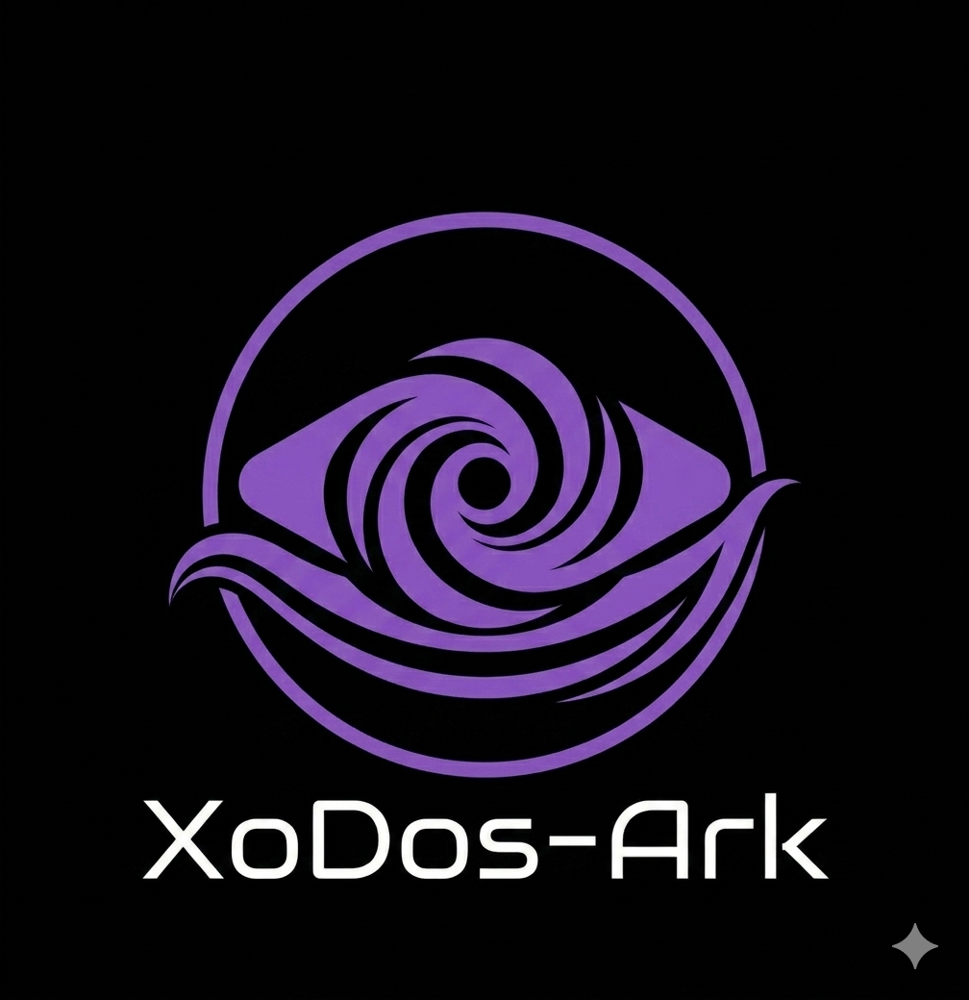

# XoDos-Ark 
[العربية](README.ar.md) | English
**XoDos-Ark: A ship small enough to fit in your pocket, but large enough to house every world you've ever imagined**
# XoDos‑Ark – The Digital Ark for Everything That Runs

**"One Ship. Every System. No Limits."**

XoDos‑Ark is a native Android application that wraps the powerful [XoDos](https://github.com/xodiosx/XoDos) and [XoDos:Re](https://github.com/xodiosx/XoDos2) emulator inside a beautiful, secure container. It preserves your entire digital legacy—operating systems, applications, and games—no matter how old or obscure. Think of it as **Noah’s Ark for software**: every byte of your history survives the flood of obsolescence.

<p align="center">
  <!-- Replace with your actual hosted logo image -->
  
</p>

---

## 🌊 The Flood of Time Can’t Drown What’s Inside the Ark

Our mission:

> *"In the deluge of digital obsolescence, every byte of your legacy deserves a place on the ship."*

XoDos‑Ark isn’t just an emulator—it’s a **vessel of imagination**. It stops your favourite vintage OS, abandoned software, and childhood games from being erased by hardware evolution. Whether you need a Windows XP desktop, a Linux playground, or a DOS game library, this single app carries them all.

> *"Bounded in a nutshell, yet king of infinite space—XoDos‑Ark is the container for every digital dream."*  
> — inspired by *Hamlet*, Act II, Scene II

---

## ✨ Why XoDos‑Ark?

- **All‑in‑One Vessel**  
  Run Windows, Linux, DOS, and exotic retro systems simultaneously—no separate VMs required.  
  *“Two of every kind? No—XoDos‑Ark holds **every** kind.”*

- **Pocket‑Sized Infinity**  
  The entire history of personal computing fits on your phone. Save snapshots, share configurations, and never lose a program again.  
  *“A ship small enough to fit in your pocket, but large enough to house every world you’ve ever imagined.”*

- **Built for Android**  
  Optimised touch controls, and seamless file sharing between guest and host. Emulation doesn’t get more portable than this.

- **Preservation First**  
  XoDos‑Ark is not about running the latest software—it’s about keeping the old ones alive. Every version you archive is a win against digital entropy.  
  *“The Ark isn’t just for survival; it’s for the rebirth of every program you thought was lost to the tide.”*

- **Secure by Design**  
  Each guest runs inside an isolated sandbox. Your host data stays protected, even when you experiment with unstable or outdated OS images.

---

## 🚢 Taglines That Capture Our Vision

 *XoDos‑Ark: Where the world sees a flood, we see a cargo manifest.*
 *Weather the digital storm. Sail with XoDos‑Ark.*                 
---

## 📸 Screenshots

| Home Screen | Running Windows XP | Running Linux |
|-------------|-------------------|---------------|
|  |  |  |

---

## 🚀 Getting Started

### 📦 Download (Pre‑built APK)

Go to [Releases](https://github.com/xodiosx/XoDos-Ark/releases) and grab the latest stable APK.  
Minimum Android version: **10 (API 29)**. The ark sails on even older devices.

### 🔨 help Building the Ark from Source

1. **Clone the repository**
   ```bash
   git clone https://github.com/xodiosx/XoDos-Ark.git
   cd XoDos-Ark
```

## 🙏 Acknowledgments

XoDos‑Ark stands on the shoulders of giants:

- [Termux](https://github.com/termux/termux-app) – the terminal emulator and Linux environment for Android  
- [Termux-X11](https://github.com/termux/termux-x11) – a Termux add-on that runs X11 applications natively  
- [Wayland](https://wayland.freedesktop.org/) – the modern display protocol enabling seamless graphical integration  
- [Trierarch](https://github.com/Beauty114514/trierarch/) – an inspiring open-source vessel